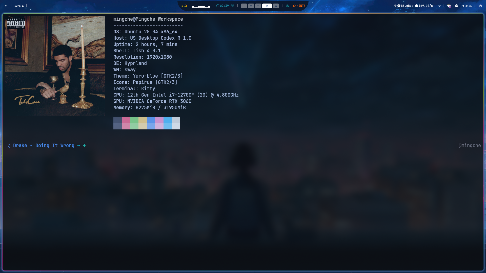
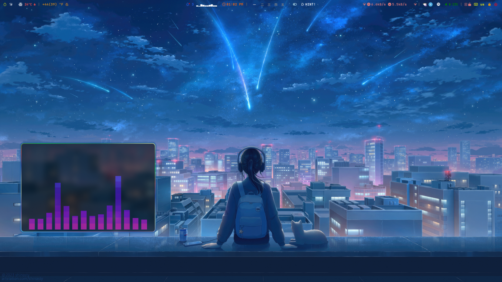
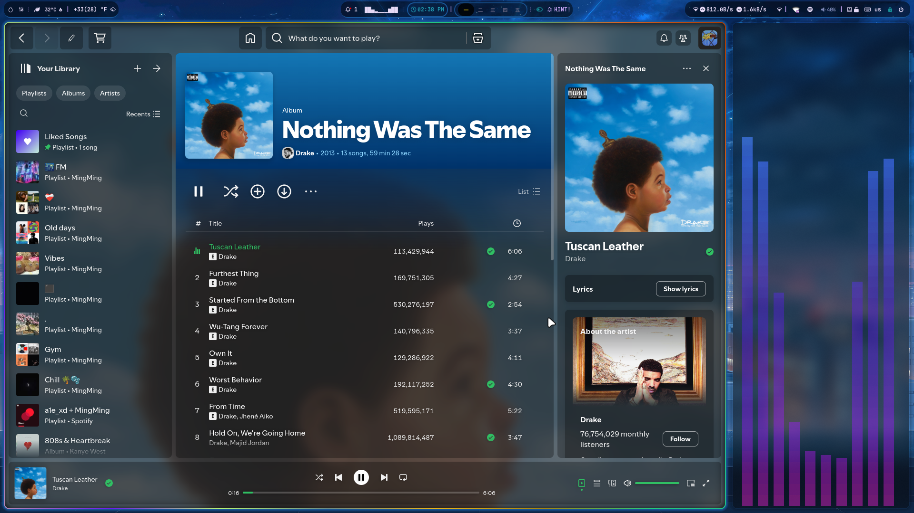

# ✨ Welcome to My Dotfiles! ✨

This repo contains all of my **configuration files** for my 🐧 **Hyprland** setup 


## 🖼️ Gallery

<div align="center">









</div>


---


## Terminal Tools I Use

Here are my favorite CLI eye-candies that make ubuntu look 10x better

| 🧩 Tool        | 📝 Description                         | 🔗 Link                                |
|----------------|----------------------------------------|----------------------------------------------|
| 🐟 [Fish](https://github.com/fish-shell/fish-shell) | Friendly interactive shell with autocomplete | [fish-shell/fish-shell](https://github.com/fish-shell/fish-shell) |
| 📸 [Neofetch](https://github.com/dylanaraps/neofetch) | Display system info with custom image   | [dylanaraps/neofetch](https://github.com/dylanaraps/neofetch) |
| 🎵 [cava](https://github.com/karlstav/cava)         | Terminal based audio visualizer     | [karlstav/cava](https://github.com/karlstav/cava) |
| 💻 [cmatrix](https://github.com/abishekvashok/cmatrix) | Matrix-style terminal screen saver           | [abishekvashok/cmatrix](https://github.com/abishekvashok/cmatrix) |
| 🌧️ [terminal-rain](https://github.com/rmaake1/terminal-rain-lightning) | Raindrop animations in your terminal          | [rmaake1/terminal-rain](https://github.com/rmaake1/terminal-rain-lightning) |
| 🧵 [pipes](https://github.com/pipeseroni/pipes.sh)  | Draws colorful, random pipes        | [pipeseroni/pipes.sh](https://github.com/pipeseroni/pipes.sh) |
| 🪔 [lavat](https://github.com/AngelJumbo/lavat)     | Lava lamp simulation in your terminal        | [AngelJumbo/lavat](https://github.com/AngelJumbo/lavat) |
| 🌱 [cbonsai](https://gitlab.com/jallbrit/cbonsai/)  | Grows an ASCII bonsai tree        | [jallbrit/cbonsai](https://gitlab.com/jallbrit/cbonsai/) |
| 🌐 [globe](https://github.com/adamsky/globe)        | Spinning globe in your terminal          | [adamsky/globe](https://github.com/adamsky/globe) |
| 🗺️ [mapscii](https://github.com/rastapasta/mapscii) | Browse the world map via your terminal       | [rastapasta/mapscii](https://github.com/rastapasta/mapscii) |
| 🎨 [colorscript](https://github.com/charitarthchugh/shell-color-scripts) | Colorful eye-candy      | [charitarthchugh/colorscript](https://github.com/charitarthchugh/shell-color-scripts) |
| 🎧 [spicetify](https://github.com/spicetify/spicetify-cli) | Fully customize your spotify       | [spicetify/spicetify-cli](https://github.com/spicetify/spicetify-cli) |
| ⚡ [fastfetch](https://github.com/fastfetch-cli/fastfetch) | Display system info         | [fastfetch-cli/fastfetch](https://github.com/fastfetch-cli/fastfetch) |
| 🚂 [sl](https://www.cyberciti.biz/tips/displays-animations-when-accidentally-you-type-sl-instead-of-ls.html) | Train appears when you mistype `ls`        | [sl](https://www.cyberciti.biz/tips/displays-animations-when-accidentally-you-type-sl-instead-of-ls.html) |
| 🫧 [bubblescli](https://github.com/MingcheL1/BubblesCLI) | Frutiger-Aero inspired screensaver that blows bubbles into your terminal       | [mingchel1/bubblescli](https://github.com/MingcheL1/BubblesCLI) |
---

## ⚡🔧 Quick Setup

Clone this repo and use `stow` to symlink

```bash
git clone https://github.com/MingcheL1/dotfiles.git
cd dotfiles
stow fish neofetch kitty  
```
